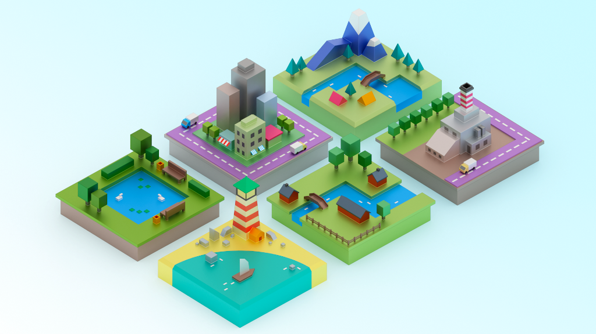

# Knowledge Graph Radar

The Knowledge Graph Radar is an attempt to keep track of interesting people, projects, applications and so forth *related to* the [knowledge graph](https://en.wikipedia.org/wiki/Knowledge_Graph) space.

> When I say "*related to*" I am going broad rather than narrow. That is, I will porbably be including a lot of stuff that is only quite loosely related to knowledge graphs per se but that **could be** of interest within the context of the development of [Contextualise](https://contextualise.dev), a (collaborative) knowledge management application that I am developing. Having said that, I will try to stay on topic as much as possible :) 

## Links

### People

* [Andy Matuschak](https://andymatuschak.org/) is a software engineer, designer, and researcher working on technologies that expand what people can think and do

### Articles

* [Why Roam is cool](https://divinations.substack.com/p/why-roam-is-cool)
* [It's Not You - It's Your Knowledge Base](https://kevinslin.com/organizing/its_not_you_its_your_knowledge_base/)
* [Prefer associative ontologies to hierarchical taxonomies](https://notes.andymatuschak.org/z29hLZHiVt7W2uss2uMpSZquAX5T6vaeSF6Cy)
* [Combining knowledge graphs, quickly and accurately](https://www.amazon.science/blog/combining-knowledge-graphs-quickly-and-accurately)
* [A Brief History of Knowledge Graph's Main Ideas](http://knowledgegraph.today/)
* [Crafting a Knowledge Graph: The Semantic Data Modeling Way](https://www.ontotext.com/blog/knowledge-graph-with-semantic-data-modeling/)

## APIs

* [Wikidata: Data access](https://www.wikidata.org/wiki/Wikidata:Data_access)

### Libraries

* [TopicDB](https://github.com/brettkromkamp/topic-db) is a topic maps-based semantic graph library (using PostgreSQL for persistence)
* [markmap-lib](https://markmap.js.org/) is a combination of Markdown syntax and mindmaps

### Applications

* [Contextualise](https://contextualise.dev/) is a tool particularly suited for organising information-heavy projects and activities consisting of unstructured and widely diverse data and information resources
* [Roam](https://roamresearch.com/) is a note-taking tool for networked thought
* [KgBase](https://kgbase.com/) is a tool to build your own knowledge graphs without writing code 
* [Alphacortex](https://www.alphacortex.io/) is a knowledge engine that helps you organize and index your data according to a taxonomy that you define
* [WebVOWL](http://vowl.visualdataweb.org/webvowl.html) is a web application for the interactive visualization of ontologies
* [Polar](https://getpolarized.io/) is a knowledge manager for web pages, textbooks, PDFs, to read and study with remotely

## How to Contribute

* Fork the [repository](https://github.com/brettkromkamp/knowledge-graph-radar) on GitHub to start making your changes to the **master** branch (or branch off of it).
* Send a pull request and bug the maintainer until it gets merged and published. :) Make sure to add yourself to [CONTRIBUTORS](https://github.com/brettkromkamp/knowledge-graph-radar/blob/master/CONTRIBUTORS.md).

## License

This work is licensed under a [Creative Commons Attribution 4.0 International License](https://creativecommons.org/licenses/by/4.0/legalcode).
