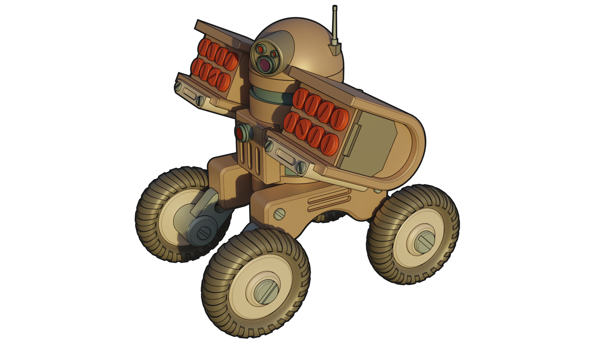

# Knowledge Graph Radar

The Knowledge Graph Radar is an attempt to keep track of interesting things **related to** the knowledge graph *space*.

## Articles

* [Why Roam is cool](https://divinations.substack.com/p/why-roam-is-cool)

## Libraries

* [TopicDB](https://github.com/brettkromkamp/topic-db) is a topic maps-based semantic graph library (using PostgreSQL for persistence)
* [markmap-lib](https://markmap.js.org/) is a combination of Markdown syntax and mindmaps

## Applications

* [Contextualise](https://contextualise.dev/) is a tool particularly suited for organising information-heavy projects and activities consisting of unstructured and widely diverse data and information resources
* [Roam](https://roamresearch.com/) is a note-taking tool for networked thought
* [KgBase](https://kgbase.com/) is a tool to build your own knowledge graphs without writing code 
* [Alphacortex](https://www.alphacortex.io/) is a knowledge engine that helps you organize and index your data according to a taxonomy that you define
* [WebVOWL](http://vowl.visualdataweb.org/webvowl.html) is a web application for the interactive visualization of ontologies

## How to Contribute

* Check for open issues or open a fresh issue to start a discussion around a feature idea or a bug.
* Fork the [repository](https://github.com/brettkromkamp/knowledge-graph-radar) on GitHub to start making your changes to the **master** branch (or branch off of it).
* Send a pull request and bug the maintainer until it gets merged and published. :) Make sure to add yourself to [CONTRIBUTORS](https://github.com/brettkromkamp/knowledge-graph-radar/blob/master/CONTRIBUTORS.md).
